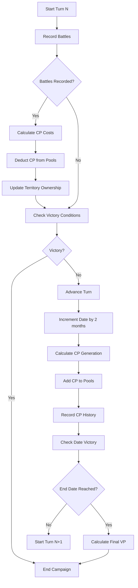
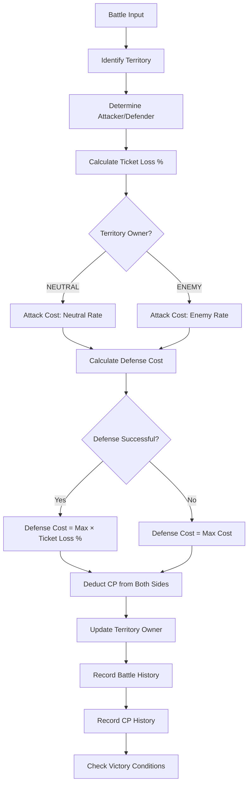
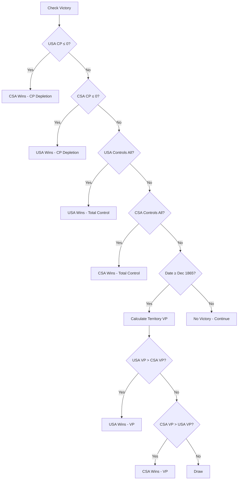

# Combat Power (CP) System - Technical Specification
## War of Rights Campaign Tracker - RS2 Vietnam Mechanics

---

## TABLE OF CONTENTS
1. [Executive Summary](#1-executive-summary)
2. [Data Structures](#2-data-structures)
3. [CP Cost Calculation Algorithms](#3-cp-cost-calculation-algorithms)
4. [Turn Advancement Logic](#4-turn-advancement-logic)
5. [Battle Processing Logic](#5-battle-processing-logic)
6. [Victory Conditions](#6-victory-conditions)
7. [Default Civil War Map](#7-default-civil-war-map)
8. [Migration Strategy](#8-migration-strategy)
9. [State Transition Diagrams](#9-state-transition-diagrams)
10. [Implementation Plan](#10-implementation-plan)

---

## 1. EXECUTIVE SUMMARY

This specification defines a Combat Power (CP) system based on Rising Storm 2: Vietnam mechanics for the War of Rights Campaign Tracker. The system replaces the simple VP accumulation model with a resource-based strategic layer where battles cost CP, and controlling territory generates CP each turn.

### Key Design Principles
- **KISS**: Simple, clear formulas for CP costs and generation
- **DRY**: Reuse existing battle processing and territory structures
- **SOLID**: Extend current system without breaking existing functionality
- **Backward Compatible**: Preserve existing campaign data where possible

### Core Mechanics Summary
- **CP Pools**: Each side (USA/CSA) maintains a Combat Power pool
- **CP Generation**: After each turn, VP (sum of controlled region points) is added to CP
- **Attack Costs**: Scale with territory value and ownership (neutral vs enemy)
- **Defense Costs**: Fixed max costs, actual cost based on success/failure
- **Victory Conditions**: CP depletion, total territorial control, or date-based VP comparison

---

## 2. DATA STRUCTURES

### 2.1 Campaign State Extension

```typescript
interface Campaign {
  // === EXISTING FIELDS (preserved) ===
  id: string;
  name: string;
  startDate: string; // ISO timestamp
  currentTurn: number;
  victoryPointsUSA: number; // DEPRECATED but kept for migration
  victoryPointsCSA: number; // DEPRECATED but kept for migration
  victoryPointTarget: number; // DEPRECATED but kept for migration
  territories: Territory[];
  battles: Battle[];
  customMap: CustomMap | null;
  mapTemplate: string;
  settings: CampaignSettings;
  
  // === NEW CP SYSTEM FIELDS ===
  combatPowerUSA: number;        // Current CP pool for USA
  combatPowerCSA: number;        // Current CP pool for CSA
  campaignDate: CampaignDate;    // Replaces simple turn counter
  cpSystemEnabled: boolean;      // Feature flag for migration
  cpHistory: CPHistoryEntry[];   // Track CP changes over time
}

interface CampaignDate {
  month: number;      // 1-12
  year: number;       // 1861-1865
  turn: number;       // Sequential turn number (for backward compat)
  displayString: string; // e.g., "April 1861"
}

interface CPHistoryEntry {
  turn: number;
  date: CampaignDate;
  usaCP: number;
  csaCP: number;
  usaChange: number;  // CP gained/lost this turn
  csaChange: number;
  reason: string;     // "Turn Generation", "Battle: Gettysburg", etc.
}
```

### 2.2 Territory Structure Extension

```typescript
interface Territory {
  // === EXISTING FIELDS (preserved) ===
  id: string;
  name: string;
  owner: 'USA' | 'CSA' | 'NEUTRAL';
  victoryPoints: number; // DEPRECATED - now used as pointValue
  isCapital: boolean;
  position: { x: number; y: number };
  adjacentTerritories: string[];
  captureHistory: CaptureHistoryEntry[];
  
  // === NEW CP SYSTEM FIELDS ===
  pointValue: number;  // 5, 10, or 15 (replaces victoryPoints semantically)
  cpGenerationRate: number; // Calculated: equals pointValue
}

// Note: pointValue should be one of: 5, 10, 15
// Each side must have exactly ONE 15-point capital region
```

### 2.3 Battle Structure Extension

```typescript
interface Battle {
  // === EXISTING FIELDS (preserved) ===
  id: string;
  turn: number;
  territoryId: string;
  attacker: 'USA' | 'CSA';
  defender: 'USA' | 'CSA' | 'NEUTRAL';
  winner: 'USA' | 'CSA';
  ticketsUSA: number;
  ticketsCSA: number;
  casualtiesUSA: number;
  casualtiesCSA: number;
  victoryPointsAwarded: number; // DEPRECATED but kept
  
  // === NEW CP SYSTEM FIELDS ===
  cpCostAttacker: number;   // Actual CP spent by attacker
  cpCostDefender: number;   // Actual CP spent by defender
  ticketLossPercentage: number; // % of tickets lost (0.0 to 1.0)
  battleType: 'ATTACK' | 'DEFENSE';
  territoryPointValue: number; // Snapshot of territory value at battle time
  wasDefenseSuccessful: boolean; // Did defender hold?
}
```

### 2.4 Campaign Settings Extension

```typescript
interface CampaignSettings {
  // === EXISTING FIELDS (preserved) ===
  victoryPointsPerTerritory: number; // DEPRECATED
  victoryPointsPerBattle: number;    // DEPRECATED
  allowTerritoryRecapture: boolean;
  requireAdjacentAttack: boolean;
  capitalBonusMultiplier: number;    // DEPRECATED
  casualtyTracking: boolean;
  
  // === NEW CP SYSTEM FIELDS ===
  startingCP: number;           // Default: 100 for both sides
  cpGenerationEnabled: boolean; // Default: true
  campaignStartDate: CampaignDate; // Default: April 1861
  campaignEndDate: CampaignDate;   // Default: December 1865
  turnsPerYear: number;         // Default: 6 (2 months per turn)
}
```

---

## 3. CP COST CALCULATION ALGORITHMS

### 3.1 Attack Cost Formula

```typescript
/**
 * Calculate CP cost for attacking a territory
 * 
 * @param territoryPointValue - 5, 10, or 15
 * @param territoryOwner - Current owner of territory
 * @param ticketLossPercentage - Percentage of tickets lost (0.0 to 1.0)
 * @returns Actual CP cost
 */
function calculateAttackCost(
  territoryPointValue: number,
  territoryOwner: 'USA' | 'CSA' | 'NEUTRAL',
  ticketLossPercentage: number
): number {
  // Determine maximum cost based on territory value and owner
  let maxCost: number;
  
  if (territoryOwner === 'NEUTRAL') {
    // Attacking neutral territory
    switch (territoryPointValue) {
      case 5:  maxCost = 50;  break;
      case 10: maxCost = 100; break;
      case 15: maxCost = 150; break;
      default: throw new Error(`Invalid point value: ${territoryPointValue}`);
    }
  } else {
    // Attacking enemy territory (50% more expensive)
    switch (territoryPointValue) {
      case 5:  maxCost = 75;  break;
      case 10: maxCost = 150; break;
      case 15: maxCost = 225; break;
      default: throw new Error(`Invalid point value: ${territoryPointValue}`);
    }
  }
  
  // Actual cost = max cost × ticket loss percentage
  const actualCost = Math.round(maxCost * ticketLossPercentage);
  
  return actualCost;
}
```

**Attack Cost Table:**

| Territory Value | Neutral Max | Enemy Max | Example (50% loss) |
|----------------|-------------|-----------|-------------------|
| 5pt            | 50 CP       | 75 CP     | 25 / 37.5 CP      |
| 10pt           | 100 CP      | 150 CP    | 50 / 75 CP        |
| 15pt (Capital) | 150 CP      | 225 CP    | 75 / 112.5 CP     |

### 3.2 Defense Cost Formula

```typescript
/**
 * Calculate CP cost for defending a territory
 * 
 * @param territoryOwner - Owner of territory being defended
 * @param defenseSuccessful - Did the defender hold the territory?
 * @param ticketLossPercentage - Percentage of tickets lost (0.0 to 1.0)
 * @returns Actual CP cost
 */
function calculateDefenseCost(
  territoryOwner: 'USA' | 'CSA' | 'NEUTRAL',
  defenseSuccessful: boolean,
  ticketLossPercentage: number
): number {
  // Determine maximum cost based on territory ownership
  const maxCost = territoryOwner === 'NEUTRAL' ? 50 : 25;
  
  if (!defenseSuccessful) {
    // Defense failed - always pay maximum cost
    return maxCost;
  } else {
    // Defense succeeded - pay based on ticket loss
    const actualCost = Math.round(maxCost * ticketLossPercentage);
    return actualCost;
  }
}
```

**Defense Cost Table:**

| Territory Type | Max Cost | Failed Defense | Successful (50% loss) |
|---------------|----------|----------------|----------------------|
| Neutral       | 50 CP    | 50 CP          | 25 CP                |
| Friendly      | 25 CP    | 25 CP          | 12.5 CP              |

### 3.3 Ticket Loss Percentage Calculation

```typescript
/**
 * Calculate ticket loss percentage for a side
 * 
 * @param ticketsStart - Starting tickets for the side
 * @param ticketsEnd - Ending tickets for the side
 * @returns Percentage lost (0.0 to 1.0)
 */
function calculateTicketLossPercentage(
  ticketsStart: number,
  ticketsEnd: number
): number {
  if (ticketsStart <= 0) return 0;
  
  const ticketsLost = ticketsStart - ticketsEnd;
  const percentage = ticketsLost / ticketsStart;
  
  // Clamp between 0 and 1
  return Math.max(0, Math.min(1, percentage));
}
```

---

## 4. TURN ADVANCEMENT LOGIC

### 4.1 Turn Advancement Algorithm

```typescript
/**
 * Advance campaign to next turn
 * - Increments date by 2 months
 * - Generates CP based on controlled territories
 * - Records CP history
 * 
 * @param campaign - Current campaign state
 * @returns Updated campaign state
 */
function advanceTurn(campaign: Campaign): Campaign {
  // 1. Calculate new date
  const newDate = advanceCampaignDate(
    campaign.campaignDate, 
    campaign.settings.turnsPerYear
  );
  
  // 2. Calculate CP generation for each side
  const cpGeneration = calculateCPGeneration(campaign.territories);
  
  // 3. Add generated CP to pools
  const newUSACP = campaign.combatPowerUSA + cpGeneration.usa;
  const newCSACP = campaign.combatPowerCSA + cpGeneration.csa;
  
  // 4. Record history
  const historyEntry: CPHistoryEntry = {
    turn: newDate.turn,
    date: newDate,
    usaCP: newUSACP,
    csaCP: newCSACP,
    usaChange: cpGeneration.usa,
    csaChange: cpGeneration.csa,
    reason: 'Turn Generation'
  };
  
  // 5. Return updated campaign
  return {
    ...campaign,
    currentTurn: newDate.turn,
    campaignDate: newDate,
    combatPowerUSA: newUSACP,
    combatPowerCSA: newCSACP,
    cpHistory: [...campaign.cpHistory, historyEntry]
  };
}
```

### 4.2 Date Advancement

```typescript
/**
 * Advance campaign date by one turn (2 months)
 * 
 * @param currentDate - Current campaign date
 * @param turnsPerYear - Number of turns per year (default 6)
 * @returns New campaign date
 */
function advanceCampaignDate(
  currentDate: CampaignDate,
  turnsPerYear: number = 6
): CampaignDate {
  const monthsPerTurn = 12 / turnsPerYear; // Default: 2 months
  
  let newMonth = currentDate.month + monthsPerTurn;
  let newYear = currentDate.year;
  
  // Handle year rollover
  if (newMonth > 12) {
    newMonth = newMonth - 12;
    newYear++;
  }
  
  const monthNames = [
    'January', 'February', 'March', 'April', 'May', 'June',
    'July', 'August', 'September', 'October', 'November', 'December'
  ];
  
  return {
    month: newMonth,
    year: newYear,
    turn: currentDate.turn + 1,
    displayString: `${monthNames[newMonth - 1]} ${newYear}`
  };
}
```

### 4.3 CP Generation Calculation

```typescript
/**
 * Calculate CP generation for both sides based on controlled territories
 * 
 * @param territories - All campaign territories
 * @returns CP generation for USA and CSA
 */
function calculateCPGeneration(territories: Territory[]): {
  usa: number;
  csa: number;
} {
  let usaCP = 0;
  let csaCP = 0;
  
  territories.forEach(territory => {
    const cpValue = territory.pointValue; // 5, 10, or 15
    
    if (territory.owner === 'USA') {
      usaCP += cpValue;
    } else if (territory.owner === 'CSA') {
      csaCP += cpValue;
    }
    // NEUTRAL territories generate no CP
  });
  
  return { usa: usaCP, csa: csaCP };
}
```

---

## 5. BATTLE PROCESSING LOGIC

### 5.1 Process Battle Result

```typescript
/**
 * Process a battle result and update campaign state
 * - Calculates CP costs
 * - Deducts CP from pools
 * - Updates territory ownership
 * - Records battle in history
 * 
 * @param campaign - Current campaign state
 * @param battleInput - Battle data from user input
 * @returns Updated campaign state
 */
function processBattleResult(
  campaign: Campaign,
  battleInput: BattleInput
): Campaign {
  const territory = campaign.territories.find(
    t => t.id === battleInput.territoryId
  );
  if (!territory) throw new Error('Territory not found');
  
  // 1. Determine battle type and participants
  const attacker = battleInput.attacker;
  const defender = territory.owner === 'NEUTRAL' ? 'NEUTRAL' : 
                   (territory.owner === attacker ? 'NEUTRAL' : territory.owner);
  const winner = battleInput.winner;
  const defenseSuccessful = (winner === defender && defender !== 'NEUTRAL');
  
  // 2. Calculate ticket loss percentages
  const attackerTicketLoss = calculateTicketLossPercentage(
    battleInput.ticketsStart[attacker],
    battleInput.ticketsEnd[attacker]
  );
  
  let defenderTicketLoss = 0;
  if (defender !== 'NEUTRAL') {
    defenderTicketLoss = calculateTicketLossPercentage(
      battleInput.ticketsStart[defender],
      battleInput.ticketsEnd[defender]
    );
  }
  
  // 3. Calculate CP costs
  const attackCost = calculateAttackCost(
    territory.pointValue,
    territory.owner,
    attackerTicketLoss
  );
  
  let defenseCost = 0;
  if (defender !== 'NEUTRAL') {
    defenseCost = calculateDefenseCost(
      territory.owner,
      defenseSuccessful,
      defenderTicketLoss
    );
  }
  
  // 4. Deduct CP from pools
  let newUSACP = campaign.combatPowerUSA;
  let newCSACP = campaign.combatPowerCSA;
  
  if (attacker === 'USA') {
    newUSACP -= attackCost;
  } else {
    newCSACP -= attackCost;
  }
  
  if (defender === 'USA') {
    newUSACP -= defenseCost;
  } else if (defender === 'CSA') {
    newCSACP -= defenseCost;
  }
  
  // 5. Update territory ownership
  const previousOwner = territory.owner;
  territory.owner = winner;
  
  // 6. Create battle record
  const battle: Battle = {
    ...battleInput,
    cpCostAttacker: attackCost,
    cpCostDefender: defenseCost,
    ticketLossPercentage: attackerTicketLoss,
    battleType: 'ATTACK',
    territoryPointValue: territory.pointValue,
    wasDefenseSuccessful: defenseSuccessful,
    victoryPointsAwarded: 0 // Deprecated
  };
  
  // 7. Update capture history
  territory.captureHistory.push({
    turn: campaign.currentTurn,
    owner: winner,
    battleId: battle.id
  });
  
  // 8. Record CP history
  const historyEntry: CPHistoryEntry = {
    turn: campaign.currentTurn,
    date: campaign.campaignDate,
    usaCP: newUSACP,
    csaCP: newCSACP,
    usaChange: attacker === 'USA' ? -attackCost : 
               (defender === 'USA' ? -defenseCost : 0),
    csaChange: attacker === 'CSA' ? -attackCost : 
               (defender === 'CSA' ? -defenseCost : 0),
    reason: `Battle: ${territory.name}`
  };
  
  // 9. Return updated campaign
  return {
    ...campaign,
    combatPowerUSA: newUSACP,
    combatPowerCSA: newCSACP,
    territories: campaign.territories.map(t => 
      t.id === territory.id ? territory : t
    ),
    battles: [...campaign.battles, battle],
    cpHistory: [...campaign.cpHistory, historyEntry]
  };
}
```

---

## 6. VICTORY CONDITIONS

### 6.1 Victory Condition Checks

```typescript
/**
 * Check all victory conditions
 * 
 * @param campaign - Current campaign state
 * @returns Victory result or null if no victory
 */
function checkVictoryConditions(campaign: Campaign): VictoryResult | null {
  // Priority order of checks
  const checks = [
    checkCPDepletion,
    checkTerritorialControl,
    checkDateVictory
  ];
  
  for (const check of checks) {
    const result = check(campaign);
    if (result) return result;
  }
  
  return null;
}

/**
 * Check if either side has depleted CP (≤0)
 */
function checkCPDepletion(campaign: Campaign): VictoryResult | null {
  if (campaign.combatPowerUSA <= 0) {
    return {
      winner: 'CSA',
      type: 'Combat Power Depletion',
      description: 'USA has exhausted their combat power and can no longer sustain the war effort'
    };
  }
  
  if (campaign.combatPowerCSA <= 0) {
    return {
      winner: 'USA',
      type: 'Combat Power Depletion',
      description: 'CSA has exhausted their combat power and can no longer sustain the war effort'
    };
  }
  
  return null;
}

/**
 * Check if either side controls all regions
 */
function checkTerritorialControl(campaign: Campaign): VictoryResult | null {
  const usaTerritories = campaign.territories.filter(t => t.owner === 'USA');
  const csaTerritories = campaign.territories.filter(t => t.owner === 'CSA');
  const total = campaign.territories.length;
  
  if (usaTerritories.length === total) {
    return {
      winner: 'USA',
      type: 'Total Territorial Control',
      description: `USA controls all ${total} territories`
    };
  }
  
  if (csaTerritories.length === total) {
    return {
      winner: 'CSA',
      type: 'Total Territorial Control',
      description: `CSA controls all ${total} territories`
    };
  }
  
  return null;
}

/**
 * Check if campaign has reached end date (December 1865)
 * Winner is determined by VP (sum of controlled territory points)
 */
function checkDateVictory(campaign: Campaign): VictoryResult | null {
  const endDate = campaign.settings.campaignEndDate;
  const currentDate = campaign.campaignDate;
  
  // Check if we've reached or passed the end date
  if (currentDate.year > endDate.year || 
      (currentDate.year === endDate.year && currentDate.month >= endDate.month)) {
    
    // Calculate VP from controlled territories
    const vpCounts = calculateTerritoryVP(campaign.territories);
    
    if (vpCounts.usa > vpCounts.csa) {
      return {
        winner: 'USA',
        type: 'Campaign End - Victory Points',
        description: `Campaign ended in December 1865. USA controls ${vpCounts.usa} VP worth of territory vs CSA's ${vpCounts.csa} VP`
      };
    } else if (vpCounts.csa > vpCounts.usa) {
      return {
        winner: 'CSA',
        type: 'Campaign End - Victory Points',
        description: `Campaign ended in December 1865. CSA controls ${vpCounts.csa} VP worth of territory vs USA's ${vpCounts.usa} VP`
      };
    } else {
      return {
        winner: 'DRAW',
        type: 'Campaign End - Draw',
        description: `Campaign ended in December 1865 with both sides controlling ${vpCounts.usa} VP worth of territory`
      };
    }
  }
  
  return null;
}

/**
 * Calculate total VP from controlled territories
 */
function calculateTerritoryVP(territories: Territory[]): {
  usa: number;
  csa: number;
} {
  let usaVP = 0;
  let csaVP = 0;
  
  territories.forEach(territory => {
    if (territory.owner === 'USA') {
      usaVP += territory.pointValue;
    } else if (territory.owner === 'CSA') {
      csaVP += territory.pointValue;
    }
  });
  
  return { usa: usaVP, csa: csaVP };
}
```

---

## 7. DEFAULT CIVIL WAR MAP

### 7.1 Territory Configuration

The default map includes 21 territories representing key Civil War regions:

**Starting Balance:**
- **USA**: 1×15pt + 2×10pt + 3×5pt = 50 VP (5 territories)
- **CSA**: 1×15pt + 2×10pt + 4×5pt = 55 VP (7 territories)
- **NEUTRAL**: 4×10pt + 3×5pt = 55 VP (7 territories)
- **TOTAL**: 160 VP across 21 territories

```typescript
function createDefaultCivilWarMap(): Territory[] {
  return [
    // USA CAPITAL
    {
      id: 'washington-dc',
      name: 'Washington D.C.',
      owner: 'USA',
      pointValue: 15,
      isCapital: true,
      position: { x: 456, y: 119 },
      adjacentTerritories: ['virginia', 'maryland']
    },
    
    // CSA CAPITAL
    {
      id: 'richmond',
      name: 'Richmond',
      owner: 'CSA',
      pointValue: 15,
      isCapital: true,
      position: { x: 454, y: 135 },
      adjacentTerritories: ['washington-dc', 'north-carolina']
    },
    
    // ... (see full specification for complete list)
  ];
}
```

---

## 8. MIGRATION STRATEGY

### 8.1 Migration Function

```typescript
/**
 * Migrate existing campaign to CP system
 */
function migrateCampaignToCP(oldCampaign: any): Campaign {
  const startingCP = 100;
  const turnsPerYear = 6;
  const monthsPerTurn = 2;
  
  // Calculate current date from turn number
  const turnsSinceStart = oldCampaign.currentTurn - 1;
  const monthsSinceStart = turnsSinceStart * monthsPerTurn;
  const yearsSinceStart = Math.floor(monthsSinceStart / 12);
  const monthsIntoYear = monthsSinceStart % 12;
  
  const campaignDate: CampaignDate = {
    month: 4 + monthsIntoYear, // Start in April
    year: 1861 + yearsSinceStart,
    turn: oldCampaign.currentTurn,
    displayString: `${getMonthName(4 + monthsIntoYear)} ${1861 + yearsSinceStart}`
  };
  
  // Migrate territories
  const territories = oldCampaign.territories.map(t => ({
    ...t,
    pointValue: t.victoryPoints || 10, // Default to 10 if not set
    cpGenerationRate: t.victoryPoints || 10
  }));
  
  // Migrate battles
  const battles = oldCampaign.battles.map(b => ({
    ...b,
    cpCostAttacker: 0, // Historical battles have no CP cost
    cpCostDefender: 0,
    ticketLossPercentage: 0,
    battleType: 'ATTACK',
    territoryPointValue: 10,
    wasDefenseSuccessful: false
  }));
  
  return {
    ...oldCampaign,
    combatPowerUSA: startingCP,
    combatPowerCSA: startingCP,
    campaignDate,
    cpSystemEnabled: true,
    cpHistory: [],
    territories,
    battles,
    settings: {
      ...oldCampaign.settings,
      startingCP,
      cpGenerationEnabled: true,
      campaignStartDate: { month: 4, year: 1861, turn: 1, displayString: 'April 1861' },
      campaignEndDate: { month: 12, year: 1865, turn: 30, displayString: 'December 1865' },
      turnsPerYear
    }
  };
}
```

---

## 9. STATE TRANSITION DIAGRAMS

### 9.1 Turn Flow Diagram



### 9.2 Battle Processing Flow



### 9.3 Victory Condition Decision Tree



---

## 10. IMPLEMENTATION PLAN

### Phase 1: Core Data Structures
**Files to Create/Modify:**
- [`campaign-tool/src/types/cpSystem.ts`](campaign-tool/src/types/cpSystem.ts) - New type definitions
- [`campaign-tool/src/data/defaultCampaign.js`](campaign-tool/src/data/defaultCampaign.js) - Add CP fields

**Tasks:**
1. Create TypeScript interfaces for CP system
2. Update [`createDefaultCampaign()`](campaign-tool/src/data/defaultCampaign.js:4) to include CP fields
3. Add migration utility function

### Phase 2: CP Calculation Logic
**Files to Create/Modify:**
- [`campaign-tool/src/utils/cpCalculations.js`](campaign-tool/src/utils/cpCalculations.js) - New file
- [`campaign-tool/src/utils/campaignLogic.js`](campaign-tool/src/utils/campaignLogic.js) - Update battle processing

**Tasks:**
1. Implement [`calculateAttackCost()`](campaign-tool/src/utils/cpCalculations.js)
2. Implement [`calculateDefenseCost()`](campaign-tool/src/utils/cpCalculations.js)
3. Implement [`calculateTicketLossPercentage()`](campaign-tool/src/utils/cpCalculations.js)
4. Update [`processBattle